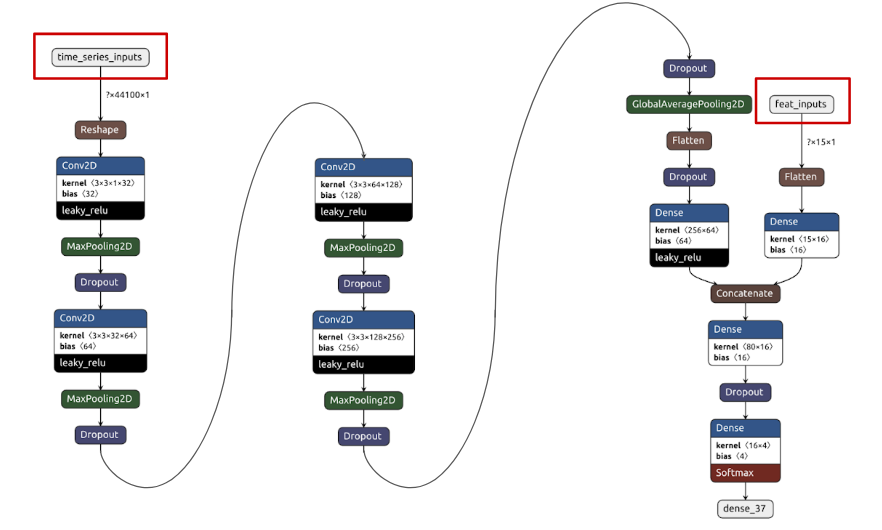
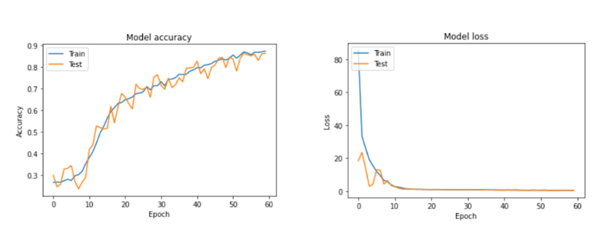
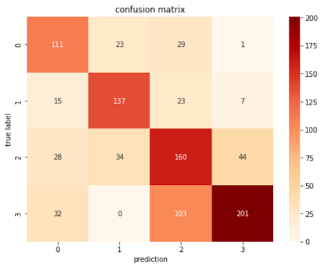
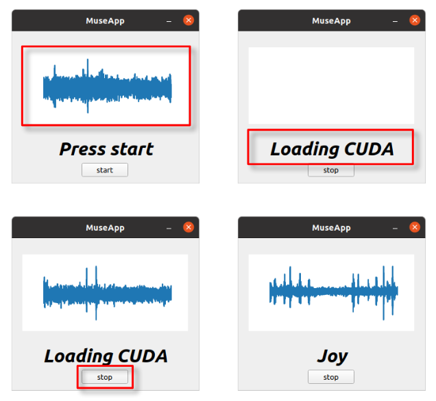

# Music Emotion Classification

This project aims to perform classification on music emotion based on the *NVIDIA* Jetson Xavier NX board.

## Data Preprocess

* Shuffle all the dataset to make training and testing set have randomly selected data
* Split the training and testing dataset
* Training set: 90% of all the data
* Testing set: 10% of all the data
* Slicing original music data to make each data smaller and make the classes balance
  * Number of tense and sad musics are about three times of the joy and peace musics
* Sliding window = 2s
* For tense and sad classes: stride = 1s
* For joy and peace classes: stride = 0.35s
* Add noises to make the model more robust and simulate the microphone recording situation
  * Randomly generated white noise
* Aside from the music data, we also calculated the high level features as another input of the model
  * `mfcc`
  * `rolloff`
  * `spectral_contrast`
  * `rms`

## Model

### Model Input & Output

* **Input**:
  1. Time series audio data: array of shape (44100, 1)
  2. Feature data derived from the music segment in 2 seconds
* **Output**
  * Classification result in one-hot encoding

### Structure

### Training Curve

## Analysis

### Evaluation

* **Test loss**: 2.073
* **Test accuracy**: 0.642

### Confusion Matrix

## GUI Application

### User interface

* We provide a simple and easy-to-use graphical user interface in our application
  * One preview window for the recorded audio
  * One text display to show the information
  * One start/stop button to control the app

### Functionality

* Pipelined recording and predicting

* No need to manually stop recording and start inferencing
* Exploit GPU on Xavier to accelerate model inference
  * On average the model can finish inference within 90ms

## Work Division

| Name         | Work            |
| ------------ | --------------- |
| `0x26rew`    | Training        |
| `choucl`     | Preprocessing   |
| `yuyuranium` | GUI development |
| `jumha`      | Training        |
